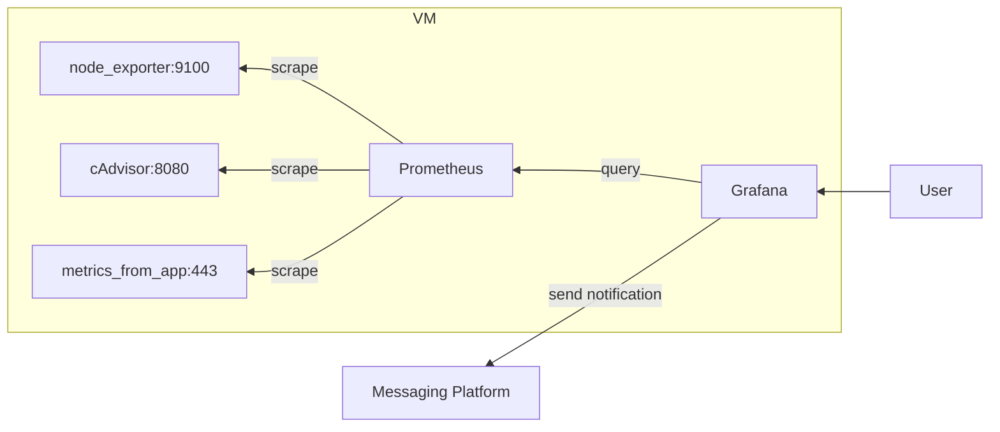

# Prometheus Demo

Run Prometheus stack on top of Docker.

## Architecture Diagram

## Starting

1. Make sure Docker is installed on your system.
2. Clone this repository.
3. Run `docker compose up -d`
4. Access Grafana on port 3000 and Prometheus on 9090. Both don't need any authentication.

## Stopping & clean-up

1. Run `docker compose down -v`. This will delete all containers and volumes.
